# DETECTION OF OBJECTS IN A BOARD GAME WARHAMMER INVASION

## All input and output videos are avaliable on this [drive](https://drive.google.com/drive/folders/1JzSkbbhrKlqEWeQcbRlIuNuAWMYDobcy)

Authors: 

- Michał Kałmucki
- Dominik Ludwiczak

# Idea is to track objects from videos of a board game on increasingly difficult videos

## Idea for detecting object:

Our tracking relies on using opencv's detect contours to detect potential objects on a frame of a video. First we apply transformations: turn to grayscale, apply sobel filter to turn frame into edge image, finally thresholding to turn image into binary image. Later on obtained binary image we use findContours funtion from opencv and filter smallest contours not to detect too much noise. We keep information about found contours and their position on a frame.

## Templates:

In order to get idea of what we have detected we use opencv's matchTemplates function. First we selected few elements from a game as templates:

- Capitol - our main board that determines our faction: 
  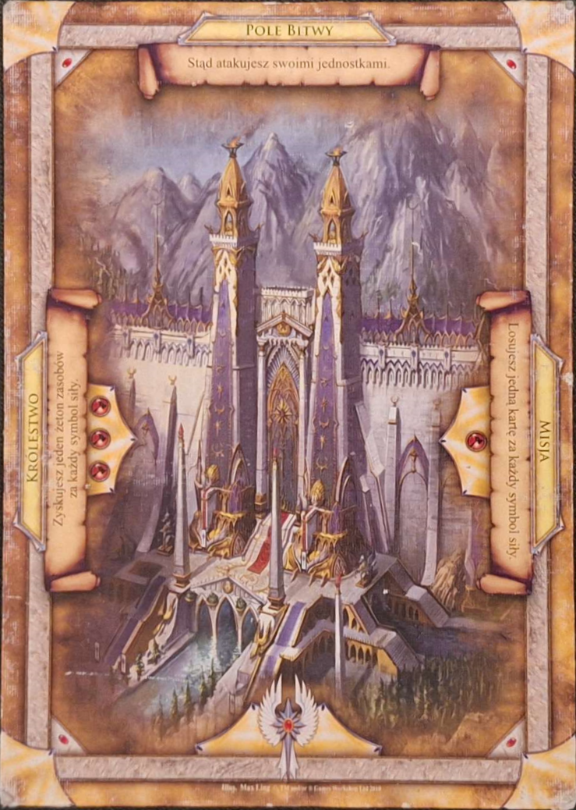
- Cards - we place them near capitolin order to develop our faction, we diffrentiate 2 kinds:

  1. Units: 
     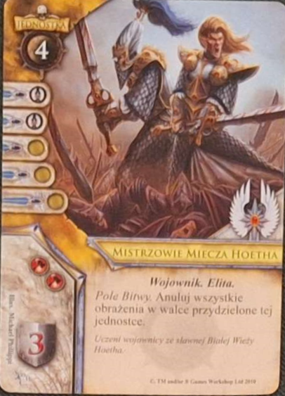
  2. Supports: 
     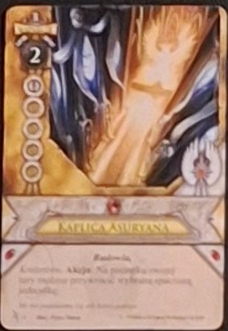

  ### Important remark:

  In theory we could use every card in deck as templates to better match them however this would cause much chaos and we believe simpler solution of using just one card of given type as templates worked decently well

- Deck - self explanatory: 
  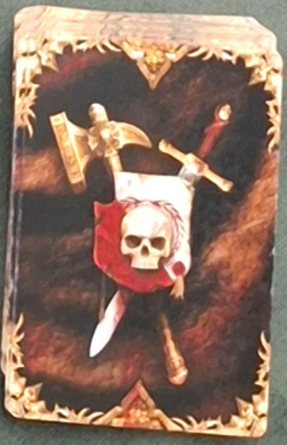

- Barrel - main resource used to buy cards, we don't highlight them but still need to keep track of them: 
  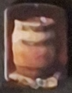

### Remark concerning templates:

Since game is for 2 players we also keep same templates for second fraction that are turned upside down to make matching possible

## Matching templates

Finally after obtaining both templates and detected objects, we can turn them into grayscale, scale templates to match size of a detected object and compare for each object which template matches it best.

## Result of detections: 

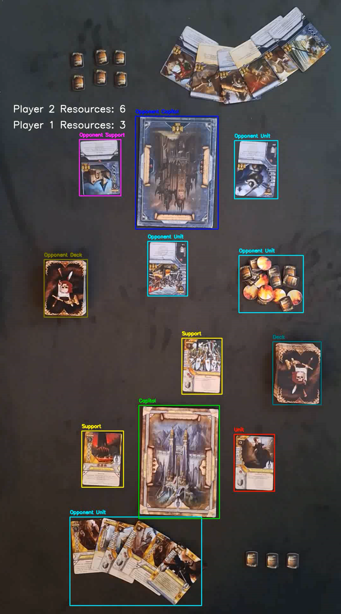 

### Detection Summary

Detections work decently well, even most card types were classified correctly between unit and support, but there are two things to point out:

- since we use min threshold not every detected object is given class, which is good, but for matching to work the threshold cannot be set to high which causes program to detect many false positives 
  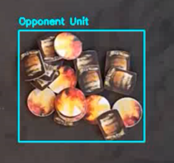
- Barrels are not highlighted as stated above, instead we keep track of how many total resources each player has 
  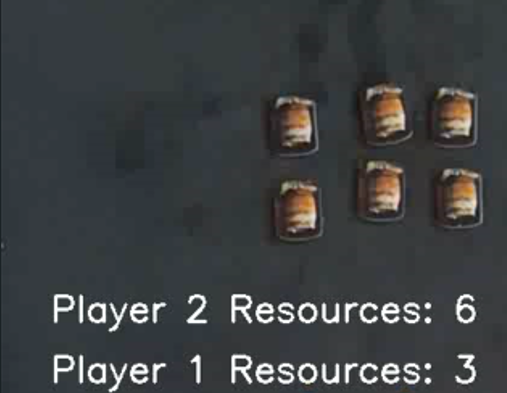

## Further operations:

Using our detections we tried to detect 2 events happening in game: first certain player drawing a card, second certain card beeing played

### Detecting card draw:

Idea of detecting card draw is very simple, if a deck of a given player disapears from detection we assume it is hidden by his hand hence card is being drawn by that player. Obviously such simple assumption causes false positives when player is correcting deck, or there is problem with detecting deck in general 
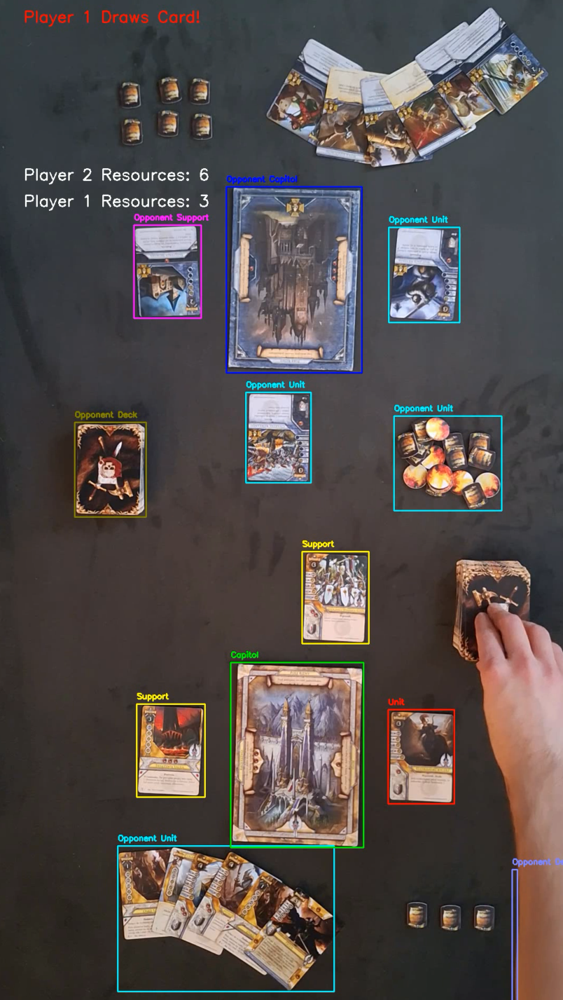

### Detecting a card beeing played

To detect which card has been played we keep track of how many cards of each type have been detected in each processed frame, then we use noise cancelling funcion that keeps track only of a highest number of detections that were registered in 2 consecutive frames, to detect when number of detected cards increases for given card type. Information about draw is displayed more or less in a middle of a screen however it collides a bit with elements of game so sometimes it's hard to read. 
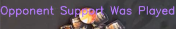

## Video types:

- **Easy** - All given examples were from a simplest video type, these videos were made in a daylight with all cards beeing more or less vertical, most detections were correct with few exceptions like wrong card type (which was most likely caused by card's art), sometimes there were problems like card draw wasn't detected since hand reaching for card was classified as shaded deck (more on that later) but result was quite satisfactory.
- **Medium** - videos of medium type were made in a light of a bedside lamp, which causes decks to cast shadow, and few cards to be overexposed, in order to tackle problems with lighting we had to introduce new template for deck that casts shadow 
  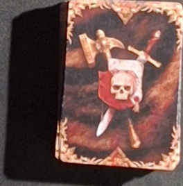 
  without this template detection of decks was nearly impossible, however introducing it arrived at a cost of sometimes missing detection of a card beeing drawn since this template was far easier to match for anything that casts shadow including player's hand

- **Hard** - in hard videos on top of bad lighting all cards and capitols were placed at different angles which would make our approach with matching templates useless. However we discovered solution which is based on adjusting our object detection so for each detected contour we try to approximate its content with a rectangle, then find it's corners to be able to shift found objects so the content ends up vertical. This worked rather well and made detections possible even for the tilted cards. 
  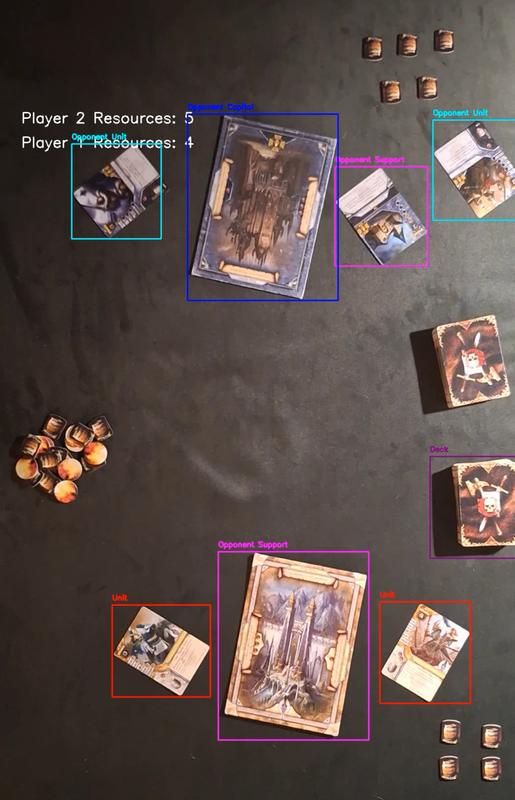

# Summary:

Overall our detections had quite a few misses and movement on a video usually needed to stablilize for better accuracy, however based on high ambitions of separating both players cards and two types of cards in detections we find results decent.
